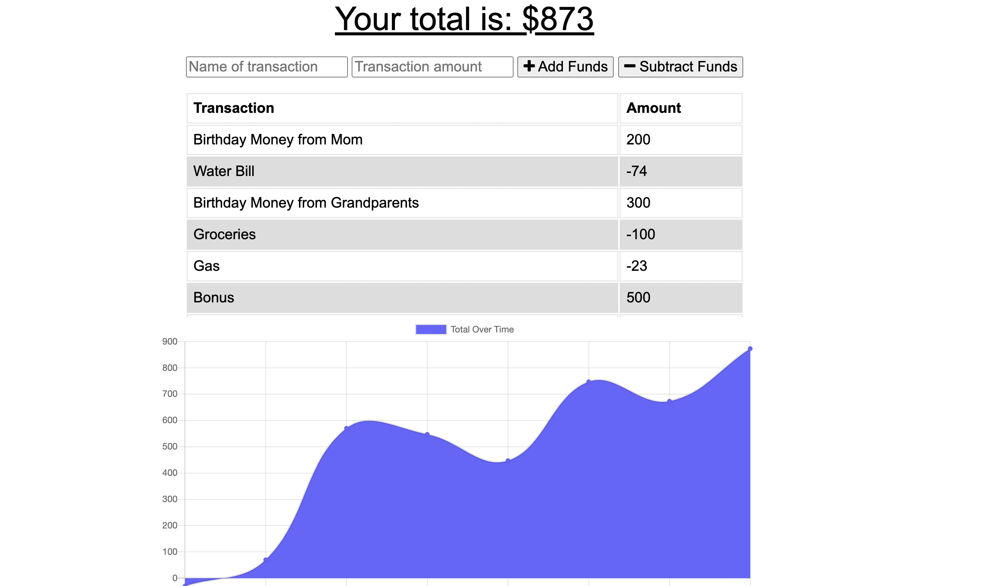
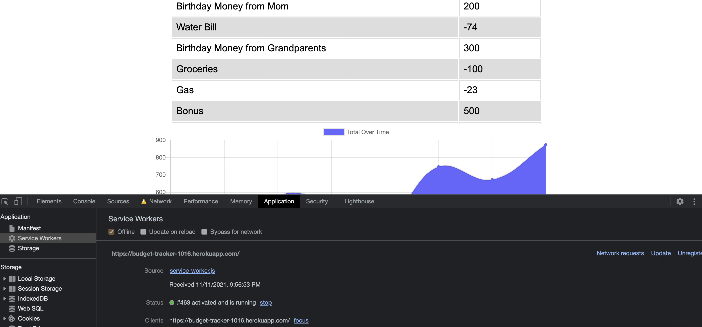

# Budget Tracker

  

  ## Description
  Users are able to keep track of deposits and withdrawals to their bank account either online or offline. Offline entries appear once application is back online keeping accurate track of budget information. MongoDB, Mongoose, IndexedDB, and Express were the main technologies used to create this PWA.

  ## Table of Contents
  * [Installation](#installation)
  * [Usage](#usage)
  * [License](#license)
  * [Contact](#contact)

  ## Installation
  Clone application. Run"npm install". Check to make sure all proper dependencies are installed: compression, express, lite-server, mongoose, and morgan.

  ## Usage
  Should a user choose to run the application locally, open a terminal first and run "mongo" or "mongod" to check connection to database. Open terminal in project and run "node server.js" and connect to local port. Otherwise click live deployed link below.

  [Budget Tracker Deployed Application](https://budget-tracker-1016.herokuapp.com/)

  [View video of Budget Tracker usage here.](https://watch.screencastify.com/v/ye2NoH0CUMkmJWqZ0W8a)

  
  

  ## License
  License for this project: [MIT License](https://choosealicense.com/licenses/mit/)

  ## Contact
  With any questions or concerns, please contact me via GitHub at [cianfich1016](https://github.com/cianfich1016) or by email at cianfich@gmail.com.
